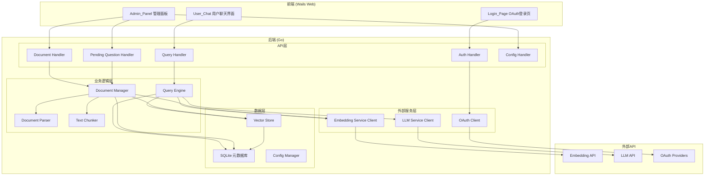
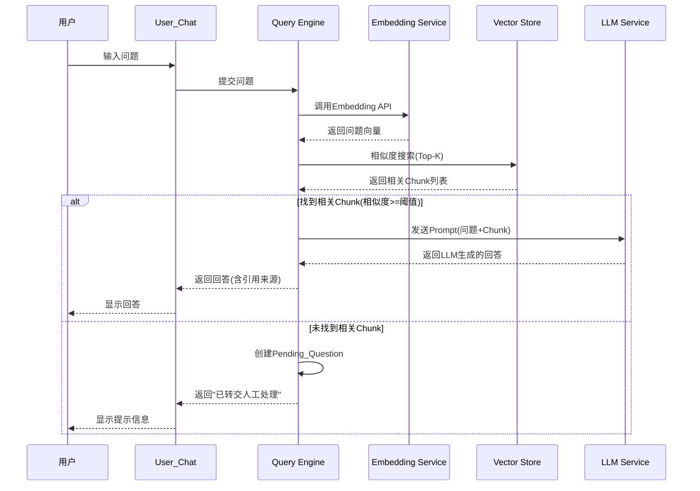
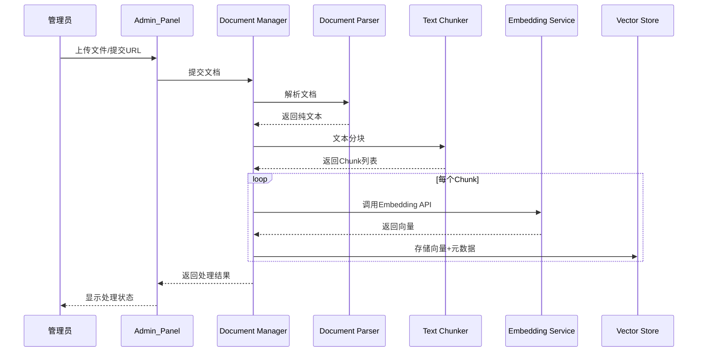

# 设计文档

## 概述

本系统是一个基于RAG（Retrieval-Augmented Generation）架构的LLM驱动软件自助服务平台。系统采用Go + Wails框架构建，前端使用Web技术（HTML/CSS/JavaScript），后端使用Go语言。核心流程为：用户提问 → Embedding向量化 → 向量数据库检索 → LLM总结生成回答。管理员可上传多种格式文档，系统自动解析、分块、向量化后存入向量数据库。对于无法自动回答的问题，系统支持管理员人工回答并将回答内容纳入知识库。用户通过OAuth第三方账号登录。

## 架构

### 整体架构

系统采用前后端分离的分层架构，通过Wails框架桥接Go后端和Web前端。



### RAG查询流程



### 文档处理流程



## 组件与接口

### 1. Query Engine（查询引擎）

负责协调RAG查询流程的核心组件。

```go
type QueryEngine struct {
    embeddingService EmbeddingService
    vectorStore      VectorStore
    llmService       LLMService
    db               *sql.DB
    config           *Config
}

type QueryRequest struct {
    Question string `json:"question"`
    UserID   string `json:"user_id"`
}

type QueryResponse struct {
    Answer     string       `json:"answer"`
    Sources    []SourceRef  `json:"sources"`
    IsPending  bool         `json:"is_pending"`
    Message    string       `json:"message,omitempty"`
}

type SourceRef struct {
    DocumentName string `json:"document_name"`
    ChunkIndex   int    `json:"chunk_index"`
    Snippet      string `json:"snippet"`
}

// Query 执行RAG查询流程
func (qe *QueryEngine) Query(req QueryRequest) (*QueryResponse, error)
```

### 2. Document Manager（文档管理器）

负责文档的上传、处理和生命周期管理。

```go
type DocumentManager struct {
    parser           *DocumentParser
    chunker          *TextChunker
    embeddingService EmbeddingService
    vectorStore      VectorStore
    db               *sql.DB
}

type UploadFileRequest struct {
    FileName string `json:"file_name"`
    FileData []byte `json:"file_data"`
    FileType string `json:"file_type"`
}

type UploadURLRequest struct {
    URL string `json:"url"`
}

type DocumentInfo struct {
    ID        string    `json:"id"`
    Name      string    `json:"name"`
    Type      string    `json:"type"`
    Status    string    `json:"status"` // "processing", "success", "failed"
    Error     string    `json:"error,omitempty"`
    CreatedAt time.Time `json:"created_at"`
}

func (dm *DocumentManager) UploadFile(req UploadFileRequest) (*DocumentInfo, error)
func (dm *DocumentManager) UploadURL(req UploadURLRequest) (*DocumentInfo, error)
func (dm *DocumentManager) DeleteDocument(docID string) error
func (dm *DocumentManager) ListDocuments() ([]DocumentInfo, error)
```

### 3. Document Parser（文档解析器）

使用vantagedatachat开源库解析不同格式的文档。

```go
type DocumentParser struct{}

type ParseResult struct {
    Text     string `json:"text"`
    Metadata map[string]string `json:"metadata"`
}

func (dp *DocumentParser) Parse(fileData []byte, fileType string) (*ParseResult, error)
func (dp *DocumentParser) parsePDF(data []byte) (*ParseResult, error)   // 使用 gopdf2
func (dp *DocumentParser) parseWord(data []byte) (*ParseResult, error)  // 使用 goword
func (dp *DocumentParser) parseExcel(data []byte) (*ParseResult, error) // 使用 goexcel
func (dp *DocumentParser) parsePPT(data []byte) (*ParseResult, error)   // 使用 goppt
```

### 4. Text Chunker（文本分块器）

将文本按固定大小分割为Chunk，支持重叠。

```go
type TextChunker struct {
    ChunkSize int // 默认512
    Overlap   int // 默认128
}

type Chunk struct {
    Text       string `json:"text"`
    Index      int    `json:"index"`
    DocumentID string `json:"document_id"`
}

func (tc *TextChunker) Split(text string, documentID string) []Chunk
```

### 5. Embedding Service（嵌入服务客户端）

```go
type EmbeddingService interface {
    Embed(text string) ([]float64, error)
    EmbedBatch(texts []string) ([][]float64, error)
}

type APIEmbeddingService struct {
    Endpoint  string
    APIKey    string
    ModelName string
    client    *http.Client
}

func (s *APIEmbeddingService) Embed(text string) ([]float64, error)
func (s *APIEmbeddingService) EmbedBatch(texts []string) ([][]float64, error)
```

### 6. LLM Service（LLM服务客户端）

```go
type LLMService interface {
    Generate(prompt string, context []string, question string) (string, error)
}

type APILLMService struct {
    Endpoint    string
    APIKey      string
    ModelName   string
    Temperature float64
    MaxTokens   int
    client      *http.Client
}

func (s *APILLMService) Generate(prompt string, context []string, question string) (string, error)
```

### 7. Vector Store（向量存储）

```go
type VectorStore interface {
    Store(docID string, chunks []VectorChunk) error
    Search(queryVector []float64, topK int, threshold float64) ([]SearchResult, error)
    DeleteByDocID(docID string) error
}

type VectorChunk struct {
    ChunkText    string    `json:"chunk_text"`
    ChunkIndex   int       `json:"chunk_index"`
    DocumentID   string    `json:"document_id"`
    DocumentName string    `json:"document_name"`
    Vector       []float64 `json:"vector"`
}

type SearchResult struct {
    ChunkText    string  `json:"chunk_text"`
    ChunkIndex   int     `json:"chunk_index"`
    DocumentID   string  `json:"document_id"`
    DocumentName string  `json:"document_name"`
    Score        float64 `json:"score"`
}

// SQLiteVectorStore 使用SQLite + 自实现余弦相似度的向量存储
type SQLiteVectorStore struct {
    db *sql.DB
}
```

### 8. OAuth Client（OAuth认证客户端）

```go
type OAuthClient struct {
    providers map[string]*OAuthProviderConfig
}

type OAuthProviderConfig struct {
    ClientID     string
    ClientSecret string
    AuthURL      string
    TokenURL     string
    RedirectURL  string
    Scopes       []string
}

type OAuthUser struct {
    ID       string `json:"id"`
    Email    string `json:"email"`
    Name     string `json:"name"`
    Provider string `json:"provider"`
}

func (oc *OAuthClient) GetAuthURL(provider string) (string, error)
func (oc *OAuthClient) HandleCallback(provider string, code string) (*OAuthUser, error)
```

### 9. Pending Question Manager（待回答问题管理）

```go
type PendingQuestionManager struct {
    db               *sql.DB
    documentManager  *DocumentManager
    llmService       LLMService
}

type PendingQuestion struct {
    ID        string    `json:"id"`
    Question  string    `json:"question"`
    UserID    string    `json:"user_id"`
    Status    string    `json:"status"` // "pending", "answered"
    Answer    string    `json:"answer,omitempty"`
    CreatedAt time.Time `json:"created_at"`
}

type AdminAnswerRequest struct {
    QuestionID string   `json:"question_id"`
    Text       string   `json:"text,omitempty"`
    ImageData  []byte   `json:"image_data,omitempty"`
    URL        string   `json:"url,omitempty"`
}

func (pm *PendingQuestionManager) CreatePending(question string, userID string) (*PendingQuestion, error)
func (pm *PendingQuestionManager) ListPending(status string) ([]PendingQuestion, error)
func (pm *PendingQuestionManager) AnswerQuestion(req AdminAnswerRequest) error
```

### 10. Config Manager（配置管理器）

```go
type Config struct {
    LLM       LLMConfig       `json:"llm"`
    Embedding EmbeddingConfig `json:"embedding"`
    Vector    VectorConfig    `json:"vector"`
    OAuth     OAuthConfig     `json:"oauth"`
    Admin     AdminConfig     `json:"admin"`
}

type LLMConfig struct {
    Endpoint    string  `json:"endpoint"`
    APIKey      string  `json:"api_key"`
    ModelName   string  `json:"model_name"`
    Temperature float64 `json:"temperature"`
    MaxTokens   int     `json:"max_tokens"`
}

type EmbeddingConfig struct {
    Endpoint  string `json:"endpoint"`
    APIKey    string `json:"api_key"`
    ModelName string `json:"model_name"`
}

type VectorConfig struct {
    DBPath    string  `json:"db_path"`
    ChunkSize int     `json:"chunk_size"`
    Overlap   int     `json:"overlap"`
    TopK      int     `json:"top_k"`
    Threshold float64 `json:"threshold"`
}

type OAuthConfig struct {
    Providers map[string]OAuthProviderConfig `json:"providers"`
}

type AdminConfig struct {
    PasswordHash string `json:"password_hash"`
}

type ConfigManager struct {
    configPath string
    config     *Config
    mu         sync.RWMutex
}

func (cm *ConfigManager) Load() error
func (cm *ConfigManager) Save() error
func (cm *ConfigManager) Get() *Config
func (cm *ConfigManager) Update(updates map[string]interface{}) error
```

## 数据模型

### SQLite数据库表结构

系统使用SQLite作为元数据存储和向量存储的底层数据库。

#### documents 表

| 字段 | 类型 | 说明 |
|------|------|------|
| id | TEXT PRIMARY KEY | 文档唯一ID (UUID) |
| name | TEXT NOT NULL | 文档名称 |
| type | TEXT NOT NULL | 文件类型 (pdf/word/excel/ppt/url) |
| status | TEXT NOT NULL | 处理状态 (processing/success/failed) |
| error | TEXT | 错误信息 |
| created_at | DATETIME | 创建时间 |

#### chunks 表

| 字段 | 类型 | 说明 |
|------|------|------|
| id | TEXT PRIMARY KEY | Chunk唯一ID |
| document_id | TEXT NOT NULL | 关联文档ID (外键) |
| document_name | TEXT NOT NULL | 文档名称 |
| chunk_index | INTEGER NOT NULL | Chunk在文档中的序号 |
| chunk_text | TEXT NOT NULL | Chunk文本内容 |
| embedding | BLOB NOT NULL | 向量数据 (序列化的float64数组) |
| created_at | DATETIME | 创建时间 |

#### pending_questions 表

| 字段 | 类型 | 说明 |
|------|------|------|
| id | TEXT PRIMARY KEY | 问题唯一ID (UUID) |
| question | TEXT NOT NULL | 问题内容 |
| user_id | TEXT NOT NULL | 提问用户ID |
| status | TEXT NOT NULL | 状态 (pending/answered) |
| answer | TEXT | 管理员回答内容 |
| llm_answer | TEXT | LLM生成的总结回答 |
| created_at | DATETIME | 创建时间 |
| answered_at | DATETIME | 回答时间 |

#### users 表

| 字段 | 类型 | 说明 |
|------|------|------|
| id | TEXT PRIMARY KEY | 用户唯一ID |
| email | TEXT UNIQUE | 用户邮箱 |
| name | TEXT | 用户名称 |
| provider | TEXT NOT NULL | OAuth提供商 |
| provider_id | TEXT NOT NULL | OAuth提供商用户ID |
| created_at | DATETIME | 创建时间 |
| last_login | DATETIME | 最后登录时间 |

#### sessions 表

| 字段 | 类型 | 说明 |
|------|------|------|
| id | TEXT PRIMARY KEY | 会话ID |
| user_id | TEXT NOT NULL | 用户ID (外键) |
| expires_at | DATETIME NOT NULL | 过期时间 |
| created_at | DATETIME | 创建时间 |

### 向量数据序列化

Embedding向量（[]float64）使用二进制序列化存储在SQLite的BLOB字段中：

```go
// 序列化：[]float64 → []byte
func SerializeVector(vec []float64) []byte {
    buf := new(bytes.Buffer)
    binary.Write(buf, binary.LittleEndian, vec)
    return buf.Bytes()
}

// 反序列化：[]byte → []float64
func DeserializeVector(data []byte) []float64 {
    vec := make([]float64, len(data)/8)
    buf := bytes.NewReader(data)
    binary.Read(buf, binary.LittleEndian, &vec)
    return vec
}
```

### 余弦相似度计算

```go
func CosineSimilarity(a, b []float64) float64 {
    var dotProduct, normA, normB float64
    for i := range a {
        dotProduct += a[i] * b[i]
        normA += a[i] * a[i]
        normB += b[i] * b[i]
    }
    if normA == 0 || normB == 0 {
        return 0
    }
    return dotProduct / (math.Sqrt(normA) * math.Sqrt(normB))
}
```

### 配置文件格式

配置文件使用JSON格式，存储在应用数据目录下：

```json
{
  "llm": {
    "endpoint": "https://api.openai.com/v1",
    "api_key": "<encrypted>",
    "model_name": "gpt-4",
    "temperature": 0.3,
    "max_tokens": 2048
  },
  "embedding": {
    "endpoint": "https://api.openai.com/v1",
    "api_key": "<encrypted>",
    "model_name": "text-embedding-3-small"
  },
  "vector": {
    "db_path": "./data/helpdesk.db",
    "chunk_size": 512,
    "overlap": 128,
    "top_k": 5,
    "threshold": 0.7
  },
  "oauth": {
    "providers": {
      "google": {
        "client_id": "...",
        "client_secret": "<encrypted>"
      }
    }
  },
  "admin": {
    "password_hash": "bcrypt_hash_here"
  }
}
```

## 正确性属性

*正确性属性是一种在系统所有有效执行中都应成立的特征或行为——本质上是关于系统应该做什么的形式化陈述。属性作为人类可读规范和机器可验证正确性保证之间的桥梁。*

### Property 1: 文本分块覆盖性与重叠正确性

*For any* 非空文本字符串和有效的分块参数（chunkSize > 0, overlap >= 0, overlap < chunkSize），TextChunker.Split 生成的所有 Chunk 拼接后应覆盖原始文本的全部内容，且相邻 Chunk 之间的重叠部分长度等于配置的 overlap 值（最后一个 Chunk 除外）。

**Validates: Requirements 2.4**

### Property 2: 文件类型验证的完备性

*For any* 文件，Document_Manager 接受该文件当且仅当其文件类型属于支持列表（pdf, word, excel, ppt）。对于支持列表内的类型返回成功，对于支持列表外的类型返回"不支持的文件格式"错误。

**Validates: Requirements 2.1, 2.7**

### Property 3: 向量存储与检索的往返一致性

*For any* 一组 VectorChunk 数据，存储到 Vector_Store 后关闭连接再重新打开，通过文档ID检索应能获取到相同的 Chunk 文本、元数据和向量数据。

**Validates: Requirements 6.1, 6.4**

### Property 4: 相似度搜索结果的排序与数量约束

*For any* 查询向量和已存储的向量集合，Vector_Store.Search 返回的结果应满足：(a) 结果数量不超过 Top-K，(b) 结果按余弦相似度降序排列，(c) 所有结果的相似度分数大于等于阈值。

**Validates: Requirements 6.2**

### Property 5: 文档删除的完整性

*For any* 已存储文档，调用 DeleteByDocID 后，该文档ID关联的所有 Chunk 和 Embedding 在 Vector_Store 中不再存在，且不影响其他文档的数据。

**Validates: Requirements 4.2, 6.3**

### Property 6: Prompt构造的完整性

*For any* 用户问题和一组检索到的 Chunk，LLM_Service 构造的 Prompt 应包含：(a) 系统提示词，(b) 所有 Chunk 的文本内容，(c) 用户的原始问题。

**Validates: Requirements 1.3, 7.2**

### Property 7: 查询响应包含引用来源

*For any* 成功的查询响应（非 Pending），返回的 QueryResponse 中 Sources 列表非空，且每个 SourceRef 包含有效的文档名称和片段位置。

**Validates: Requirements 1.4**

### Property 8: 低相似度查询创建待回答问题

*For any* 用户问题，当 Vector_Store 返回的所有结果相似度均低于阈值时，Query_Engine 应创建一条 Pending_Question 记录，关联该用户ID，且返回 IsPending=true 的响应。

**Validates: Requirements 1.5**

### Property 9: 管理员回答存入知识库

*For any* Admin_Answer（包含文字内容），提交后该内容应被分块并存储到 Vector_Store 中，后续相似度搜索应能检索到该内容对应的 Chunk。

**Validates: Requirements 3.3**

### Property 10: 待回答问题列表排序

*For any* 一组 Pending_Question 记录，ListPending 返回的列表应按 created_at 降序排列。

**Validates: Requirements 3.5**

### Property 11: 文档列表完整性

*For any* 已存储的文档集合，ListDocuments 返回的列表应包含所有文档，且每条记录包含文档名称、上传时间、文件类型和处理状态字段。

**Validates: Requirements 4.1**

### Property 12: 文本清洗有效性

*For any* Document_Parser 输出的文本，不应包含连续的空白字符（两个以上连续空格、制表符等），且首尾不应有空白字符。

**Validates: Requirements 5.6**

### Property 13: 解析错误信息完整性

*For any* 无效或损坏的文件数据，Document_Parser.Parse 返回的错误信息应包含文件名和错误原因描述。

**Validates: Requirements 5.5**

### Property 14: 向量序列化往返一致性

*For any* float64 向量，SerializeVector 后再 DeserializeVector 应得到与原始向量相同的值。

**Validates: Requirements 6.1**

### Property 15: OAuth认证URL生成

*For any* 已配置的 OAuth Provider，GetAuthURL 应返回包含正确 Client ID、重定向URL和授权范围的有效URL。

**Validates: Requirements 9.2**

### Property 16: 会话有效性验证

*For any* 用户会话，在过期时间之前应被视为有效（认证通过），在过期时间之后应被视为无效（认证失败）。

**Validates: Requirements 9.5**

### Property 17: 配置序列化往返一致性

*For any* 有效的 Config 对象，Save 后再 Load 应得到等价的 Config 对象（API密钥以加密形式存储但解密后一致）。

**Validates: Requirements 10.1**

### Property 18: API密钥加密存储

*For any* 包含 API 密钥的配置，保存到文件后，文件内容中不应包含原始明文密钥。

**Validates: Requirements 10.4**

### Property 19: 管理员密码验证

*For any* 密码字符串，只有与存储的密码哈希匹配时才应通过验证，不匹配时应拒绝访问。

**Validates: Requirements 10.3**

### Property 20: 配置热更新生效

*For any* 配置更新操作，更新后通过 ConfigManager.Get() 获取的配置应反映最新的修改值。

**Validates: Requirements 10.5**

## 错误处理

### 文档解析错误

- 文件格式不支持：返回明确的错误类型和消息
- 文件内容损坏：Document_Parser 捕获解析库异常，返回包含文件名的错误信息
- 文件过大：设置文件大小上限（默认50MB），超出时拒绝并提示

### 外部API错误

- Embedding API 失败：记录错误日志，文档处理标记为 failed 状态
- LLM API 失败：重试一次，仍失败则返回"服务暂时不可用"
- OAuth API 失败：显示登录失败提示，引导用户重试

### 数据层错误

- SQLite 写入失败：事务回滚，返回错误信息
- 向量数据损坏：记录错误日志，标记受影响文档需要重新处理

### 用户输入错误

- 空问题提交：前端验证拦截，不发送到后端
- 管理员密码错误：返回"密码错误"，不泄露额外信息

## 测试策略

### 测试框架

- 单元测试：Go 标准 `testing` 包
- 属性测试：`github.com/leanovate/gopter` 库（Go 语言的属性测试框架）
- 前端测试：Vitest + Testing Library

### 属性测试配置

- 每个属性测试最少运行 100 次迭代
- 每个属性测试必须通过注释引用设计文档中的属性编号
- 标注格式：**Feature: llm-software-helpdesk, Property {number}: {property_text}**
- 每个正确性属性由一个独立的属性测试实现

### 单元测试范围

单元测试用于验证具体示例和边界情况：

- Document_Parser 各格式解析的具体示例文件测试（需求 5.1-5.4）
- LLM_Service 重试逻辑测试（需求 7.3）
- OAuth 回调处理的具体场景测试（需求 9.3, 9.4）
- URL 抓取功能测试（需求 2.2）
- 管理员回答后 LLM 生成回复的流程测试（需求 1.7, 3.4）

### 属性测试范围

属性测试用于验证跨所有输入的通用属性：

- TextChunker 分块逻辑（Property 1）
- 文件类型验证（Property 2）
- Vector Store 存储/检索往返（Property 3）
- 相似度搜索排序与约束（Property 4）
- 文档删除完整性（Property 5）
- Prompt 构造完整性（Property 6）
- 查询响应引用来源（Property 7）
- 低相似度创建待回答问题（Property 8）
- 管理员回答存入知识库（Property 9）
- 待回答问题排序（Property 10）
- 文档列表完整性（Property 11）
- 文本清洗（Property 12）
- 错误信息完整性（Property 13）
- 向量序列化往返（Property 14）
- OAuth URL 生成（Property 15）
- 会话有效性（Property 16）
- 配置序列化往返（Property 17）
- API 密钥加密（Property 18）
- 密码验证（Property 19）
- 配置热更新（Property 20）

### 测试目录结构

```
internal/
├── parser/
│   ├── parser_test.go          # 解析器单元测试
│   └── parser_property_test.go # 解析器属性测试
├── chunker/
│   └── chunker_property_test.go
├── vectorstore/
│   └── vectorstore_property_test.go
├── query/
│   └── query_property_test.go
├── llm/
│   └── llm_property_test.go
├── auth/
│   └── auth_property_test.go
└── config/
    └── config_property_test.go
```
